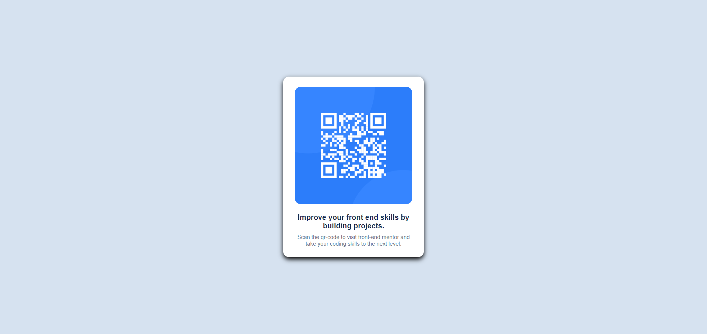

# Frontend Mentor - QR code component solution

This is a solution to the [QR code component challenge on Frontend Mentor](https://www.frontendmentor.io/challenges/qr-code-component-iux_sIO_H). Frontend Mentor challenges help you improve your coding skills by building realistic projects. 

## Table of contents

- [Overview](#overview)
  - [Screenshot](#screenshot)
  - [Links](#links)
- [My process](#my-process)
  - [Built with](#built-with)
  - [What I learned](#what-i-learned)
  - [Continued development](#continued-development)
  - [Useful resources](#useful-resources)
- [Author](#author)

## Overview

### Screenshot

### Links
- Solution URL: [https://jdean40224.github.io/qr-component/](https://jdean40224.github.io/qr-component/)

### Built with

- Semantic HTML5 markup
- CSS custom properties
- Flexbox
- CSS Grid

### What I learned

Through out this project I learned a basic understanding of how to properly code with flex box, and how to layout a good information card utilising css and html

### Continued Development

In further project I want to develop a deeper understanding of how to use flexbox, alongside organising my pages better.

### Usefule Resources

[Flexbox](https://developer.mozilla.org/en-US/docs/Web/CSS/CSS_flexible_box_layout/Basic_concepts_of_flexbox) - It is a useful article which has helped me gain a basic understanding of the concepts for flexbox.

[Card](https://developer.mozilla.org/en-US/docs/Web/CSS/Layout_cookbook/Card) - It is a useful article that helped me for develop a better understanding of how to layout a good information card.

## Author

Website - [Github](https://github.com/jdean40224)

Frontend Mentor - [jdean40224](https://www.frontendmentor.io/profile/jdean40224)
